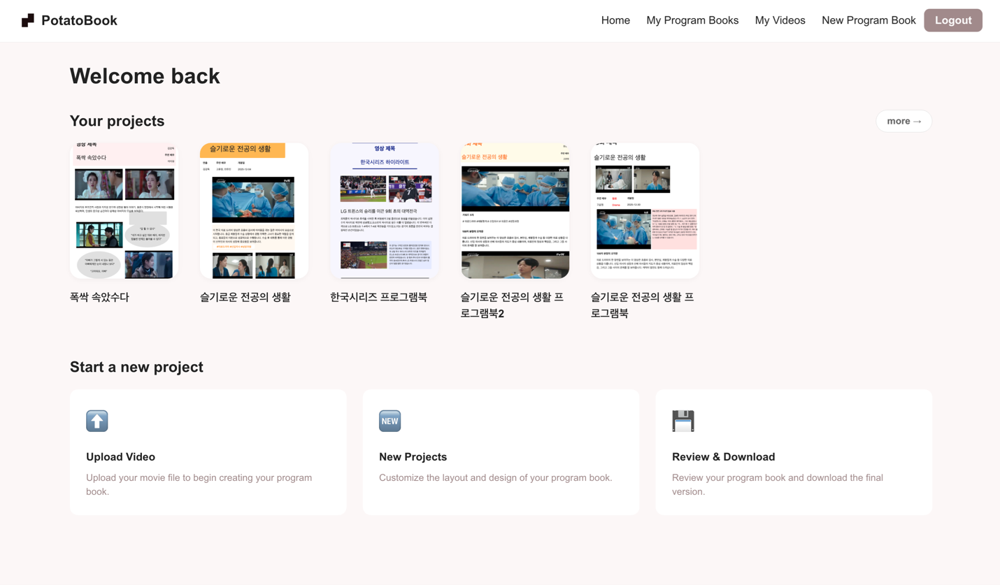
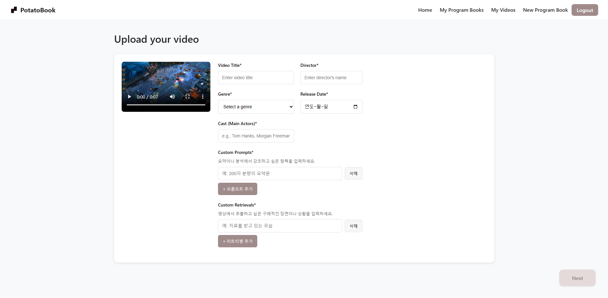
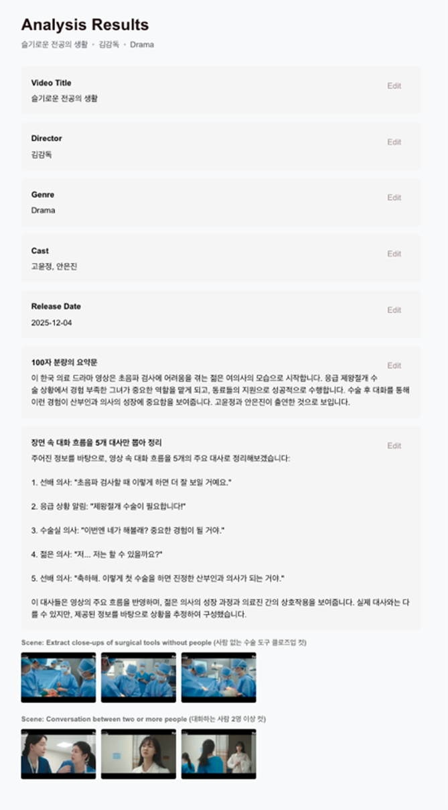
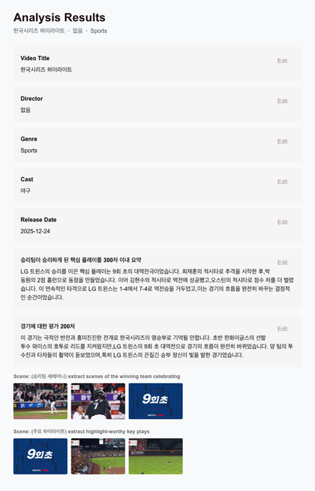
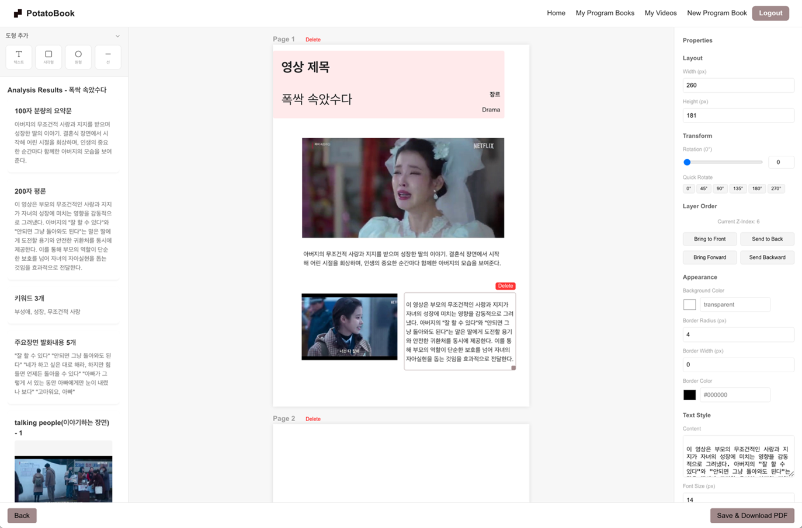
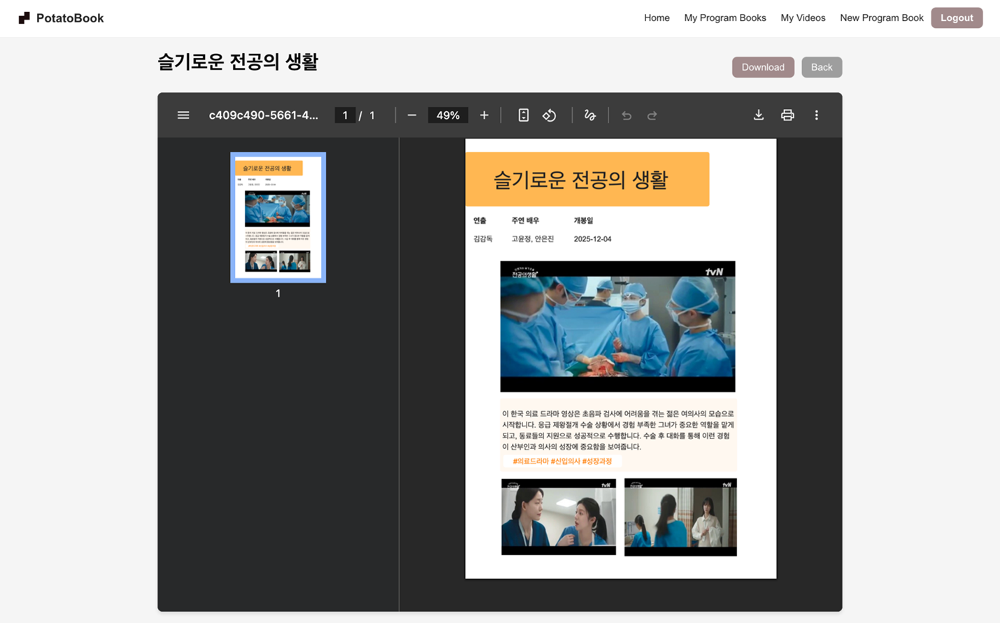
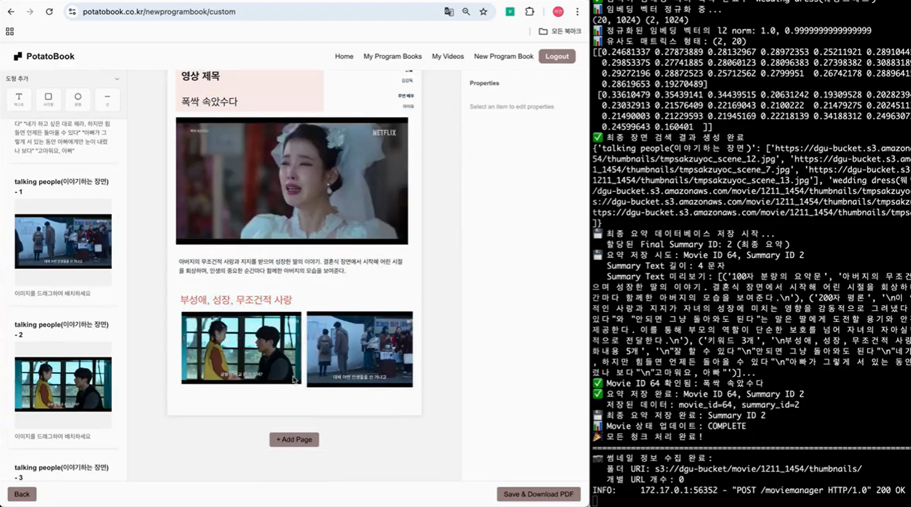

<p align="center">
  
</p>

<h1 align="center">🥔 PotatoBook</h1>

<p align="center">
  <strong>AI 기반 영화 분석 및 프로그램북 생성 플랫폼</strong>
</p>

<p align="center">
  <a href="#-데모">데모</a> •
  <a href="#-주요-기능">주요 기능</a> •
  <a href="#-기술-스택">기술 스택</a> •
  <a href="#-시작하기">시작하기</a> •
  <a href="#-프로젝트-구조">프로젝트 구조</a>
</p>

---

## 📸 스크린샷

<p align="center">
  
  <br/>
  <em>홈 화면 - 프로젝트 대시보드</em>
</p>

<p align="center">
  
  <br/>
  <em>영상 업로드 화면</em>
</p>

<p align="center">
  
  
  <br/>
  <em>AI 영화 분석 결과 (드라마 / 스포츠 경기)</em>
</p>

<p align="center">
  
  <br/>
  <em>프로그램북 레이아웃 편집기</em>
</p>

<p align="center">
  
  <br/>
  <em>완성된 프로그램북 PDF</em>
</p>

---

## 🎬 데모 영상

<p align="center">
  <a href="https://youtu.be/o-Aa03VeP18">
    
  </a>
  <br/>
  <em>▶️ 클릭하여 데모 영상 보기</em>
</p>

---

## ✨ 주요 기능

### 🎥 영상 업로드 및 분석

- **멀티파트 업로드**: 대용량 영상 파일을 안정적으로 업로드
- **AI 분석**: 업로드된 영상에서 주요 장면, 인물, 스토리 등을 자동 분석
- **커스텀 프롬프트**: 원하는 분석 항목을 직접 설정 가능

### 📖 프로그램북 생성

- **다양한 레이아웃**: 포스터, 텍스트, 그리드 등 여러 레이아웃 템플릿 제공
- **드래그 앤 드롭**: 직관적인 콘텐츠 배치
- **실시간 미리보기**: 편집 중 즉시 결과 확인
- **커스텀 편집기**: 자유로운 디자인 커스터마이징

### 📄 PDF 생성 및 관리

- **고품질 PDF 출력**: A4 사이즈 프린트 최적화
- **프로젝트 관리**: 생성한 프로그램북 목록 관리 및 다운로드
- **썸네일 미리보기**: 프로젝트 카드 형태로 직관적인 관리

### 🔐 사용자 인증

- **Google OAuth 2.0**: 간편한 소셜 로그인
- **보호된 라우팅**: 인증된 사용자만 접근 가능한 기능

---

## 🛠 기술 스택

### Frontend

| 기술             | 버전 | 설명              |
| ---------------- | ---- | ----------------- |
| **React**        | 19.1 | UI 라이브러리     |
| **TypeScript**   | 5.8  | 타입 안정성       |
| **Vite**         | 6.3  | 빌드 도구         |
| **React Router** | 6.30 | 클라이언트 라우팅 |

### 상태 관리

| 기술               | 설명              |
| ------------------ | ----------------- |
| **TanStack Query** | 서버 상태 관리    |
| **Jotai**          | 로컬/UI 상태 관리 |

### 스타일링

| 기술                  | 설명                      |
| --------------------- | ------------------------- |
| **Styled Components** | CSS-in-JS                 |
| **Emotion**           | CSS-in-JS (일부 컴포넌트) |

### PDF & 미디어

| 기술                    | 설명                |
| ----------------------- | ------------------- |
| **@react-pdf/renderer** | PDF 생성            |
| **react-pdf**           | PDF 미리보기        |
| **html2canvas**         | HTML to 이미지 변환 |
| **jsPDF**               | PDF 조작            |

### 개발 도구

| 기술          | 설명               |
| ------------- | ------------------ |
| **Storybook** | 컴포넌트 개발 환경 |
| **Jest**      | 테스트 프레임워크  |
| **ESLint**    | 코드 린팅          |
| **Prettier**  | 코드 포맷팅        |

---

## 🚀 시작하기

### 필수 요구사항

- **Node.js** >= 18.x
- **npm** >= 9.x (또는 yarn, pnpm)

### 설치

```bash
# 저장소 클론
git clone https://github.com/your-username/potato-client.git
cd potato-client

# 의존성 설치
npm install
```

### 환경 변수 설정

프로젝트 루트에 `.env` 파일을 생성하고 다음 변수들을 설정하세요:

```env
# API Server
VITE_APP_SERVER_URL=http://localhost:8080

# Google OAuth
VITE_GOOGLE_CLIENT_ID=your-google-client-id
VITE_GOOGLE_REDIRECT_URI=http://localhost:5173/auth/google/callback

# Toss Payments (결제 기능)
VITE_TOSS_CLIENT_KEY=your-toss-client-key
```

### 개발 서버 실행

```bash
npm run dev
```

브라우저에서 `http://localhost:5173`으로 접속하세요.

### 빌드

```bash
# 프로덕션 빌드
npm run build

# 빌드 미리보기
npm run preview
```

### 기타 스크립트

```bash
# 린팅
npm run lint
npm run lint:fix

# 포맷팅
npm run format
npm run format:check

# 테스트
npm run test
npm run test:watch

# Storybook
npm run storybook
npm run build-storybook
```

---

## 📁 프로젝트 구조

```
src/
├── assets/              # 정적 리소스 (이미지, 아이콘)
│   └── images/
│       ├── layouts/     # 레이아웃 템플릿 이미지
│       ├── logo/        # 로고
│       └── png/         # 기타 이미지
│
├── atoms/               # Jotai 상태 관리
│   ├── movies/          # 영화 관련 상태
│   ├── programBook/     # 프로그램북 관련 상태
│   └── selectedMovies/  # 선택된 영화 상태
│
├── components/          # 재사용 가능한 UI 컴포넌트
│   ├── Layout/          # 레이아웃 컴포넌트
│   ├── Modal/           # 모달 컴포넌트
│   ├── Pagination/      # 페이지네이션
│   ├── PrivateRoute/    # 인증 라우트 가드
│   ├── ProgramBookCard/ # 프로그램북 카드
│   ├── SearchBar/       # 검색바
│   └── TopBar/          # 상단 네비게이션
│
├── constants/           # 상수 정의
│   └── routes.ts        # 라우트 경로 상수
│
├── contexts/            # React Context
│   └── query/           # React Query Provider
│
├── hooks/               # 커스텀 훅
│   ├── useMovies.ts     # 영화 목록 훅
│   ├── useMovieUpload.ts# 영상 업로드 훅
│   ├── useProgramBooks.ts# 프로그램북 목록 훅
│   └── ...
│
├── navigation/          # 라우터 설정
│   └── Router.tsx
│
├── screens/             # 페이지 컴포넌트
│   ├── auth/            # 로그인 화면
│   ├── home/            # 홈 화면
│   ├── mymovies/        # 내 영화 관리
│   │   ├── analyze/     # 영화 분석 결과
│   │   ├── list/        # 영화 목록
│   │   └── upload/      # 영상 업로드
│   ├── myprogrambooks/  # 내 프로그램북
│   │   ├── detail/      # 상세 보기
│   │   └── list/        # 목록
│   └── newprogrambook/  # 새 프로그램북 생성
│       ├── custom/      # 커스텀 편집기
│       ├── layout/      # 레이아웃 선택
│       ├── review/      # 최종 검토
│       └── select/      # 영화 선택
│
├── services/            # API 서비스 레이어
│   ├── api/             # Axios 인스턴스 및 인터셉터
│   ├── auth/            # 인증 API
│   ├── movie/           # 영화 API
│   └── progarmBook/     # 프로그램북 API
│
├── theme/               # 디자인 시스템
│   ├── GlobalStyle.ts   # 전역 스타일
│   └── theme.ts         # 테마 토큰
│
├── types/               # TypeScript 타입 정의
│   ├── movie.ts         # 영화 관련 타입
│   └── programBook.ts   # 프로그램북 관련 타입
│
├── utils/               # 유틸리티 함수
│   ├── auth.ts          # 인증 헬퍼
│   ├── queryClient.ts   # React Query 클라이언트
│   └── ...
│
├── App.tsx              # 앱 루트 컴포넌트
└── main.tsx             # 엔트리 포인트
```

---

## 📋 주요 플로우

### 1. 영상 업로드 플로우

```
업로드 → 메타데이터 입력 → 멀티파트 업로드 → AI 분석 시작 → 완료
```

### 2. 프로그램북 생성 플로우

```
영화 선택 → 레이아웃 선택 → 콘텐츠 배치 → 미리보기 → PDF 생성 → 저장
```

---

## 🌐 API 연동

이 클라이언트는 별도의 백엔드 서버와 연동됩니다.

| 엔드포인트                 | 설명                   |
| -------------------------- | ---------------------- |
| `POST /auth/google`        | Google OAuth 토큰 교환 |
| `GET /movies`              | 영화 목록 조회         |
| `POST /movies/upload`      | 영상 업로드 (멀티파트) |
| `GET /movies/:id/analysis` | 영화 분석 결과 조회    |
| `GET /programbooks`        | 프로그램북 목록 조회   |
| `POST /programbooks`       | 프로그램북 생성        |
| `GET /programbooks/:id`    | 프로그램북 상세 조회   |

---

## 🤝 Contributing

1. Fork the Project
2. Create your Feature Branch (`git checkout -b feature/AmazingFeature`)
3. Commit your Changes (`git commit -m 'Add some AmazingFeature'`)
4. Push to the Branch (`git push origin feature/AmazingFeature`)
5. Open a Pull Request

---

## 📄 License

Distributed under the MIT License. See `LICENSE` for more information.

---

## 👥 팀

<!-- 팀원 정보를 추가하세요 -->

| 이름   | 역할     | GitHub                                 |
| ------ | -------- | -------------------------------------- |
| 김동현 | Frontend | [@Kimd0ng](https://github.com/Kimd0ng) |

---

<p align="center">
  Made with 🥔 by PotatoBook Team
</p>
